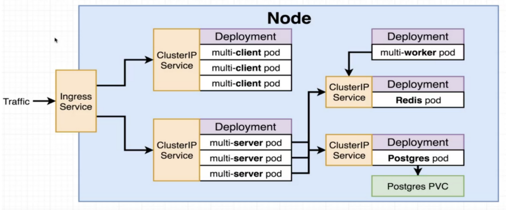

# k8s-multi-container-fibonacci
K8s config for the docker fibonacci app.

## Overview



This project is a Kubernetes deployment that runs a multi-container application to calculate the Fibonacci sequence.

The application consists of the following containers:

1. A React client that takes user input and displays the result.
2. A Node.js server api that gets the data from the database.
3. A worker server that does the Fibonacci calculations.
4. A Redis cache server.
5. A Postgres db that saves all the calculated values.

The React client sends a request to the Node.js server with the user input. The server calculates the sequence and sends it back to the client. The client then displays the result to the user.

## Prerequisites

Before you can deploy this project to a Kubernetes cluster, you will need:

1. A Kubernetes cluster up and running.
2. kubectl CLI tool installed on your local machine.
3. Docker installed on your local machine.
4. Create the postgres password as a secret

```yaml
k create secret generic pgpassword --from-literal PGPASSWORD=password
```
5. Install [ingress-nginx](https://kubernetes.github.io/ingress-nginx/deploy/#quick-start).


## Deployment

1. Clone this repository to your local machine.
2. Navigate to the root directory of the project.
3. Apply the Kubernetes deployment to your cluster:
```
k apply -f k8s --recursive
```
4. Check the status of your deployment:
```
k get pods
```
5. Once the pods are running open your web browser and navigate to http://localhost:80. You should see the Fibonacci calculator application.

### Cleanup

To delete the deployment and all associated resources from your Kubernetes cluster, run:
```
k delete -f k8s --recursive
```

## Docker Desktop dashboard

1. Grab the most current script from the install [instructions](https://kubernetes.io/docs/tasks/access-application-cluster/web-ui-dashboard/#deploying-the-dashboard-ui).
```
eg:

kubectl apply -f https://raw.githubusercontent.com/kubernetes/dashboard/v2.5.0/aio/deploy/recommended.yaml
```

2. Create a dash-admin-user.yaml file.
3. Apply the dash-admin-user configuration.
4. Create dash-clusterrole-yaml file.
5. Apply the ClusterRole configuration:
6. In the terminal, run `kubectl proxy`.

You must keep this terminal window open and the proxy running!

7. Visit the following URL in your browser to access your Dashboard:
http://localhost:8001/api/v1/namespaces/kubernetes-dashboard/services/https:kubernetes-dashboard:/proxy/

8. Obtain the token for this user and add it to the dashboard.


<b>The above steps can be found in the official [documentation](https://github.com/kubernetes/dashboard/blob/master/docs/user/access-control/creating-sample-user.md).</b>
